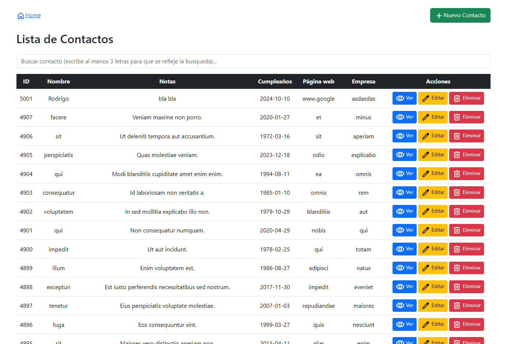
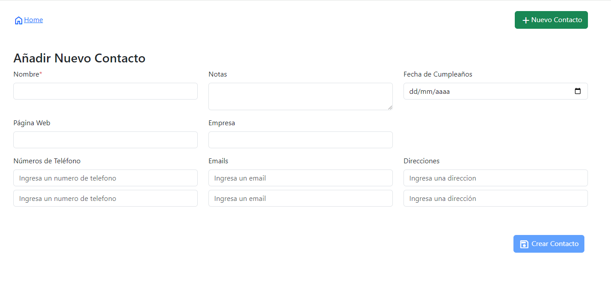

## Hola, bienvenido a la app libreta de direcciones

### Como instalar y correr la aplicacion

**Que cosas necesitas**
```
PHP 8.3
Laravel 11
Node 20+
Angular 18
Composer
Un gestor para MySql (Myql Workbench puede ser)
```

Primeramente nos situamos en un directorio nuevo y lo clonamos con: git clone https://github.com/RodriiDev/libreta-direcciones.git

-Ahora nos situamos en la carpeta de backend, podemos hacer cd backend.

-Y corremos el comand php artisan serve (esto para que nos corra el servidor donde esta alojada la api de laravel, asegurarnos que se corrió en esta direccipon http://127.0.0.1:8000/)

-Ahora nos situamos en la carpeta de frontend, podemos regresar con cd .. y luego cd frontend

-Y corremos el comando ng serve (este nos va a correr la aplicacion en angular, por lo general esta en la dirección http://localhost:4200).

Ahora para conectarnos con nuestro gestor de base de datos, tenemos que configurar el .env de nuestro backend, un ejemplo de la configuracion es la siguiente:

```
DB_CONNECTION=mysql
DB_HOST=127.0.0.1
DB_PORT=3306
DB_DATABASE=libreta_direcciones
DB_USERNAME=root
DB_PASSWORD=root
```

Ahora si podemos correr nuestras migraciones y seeder con el siguiente comando:
```
php artisan migrate:fresh --seed
```

Nos creará las tablas correspondientes y 5000 registros de contactos.

### Como se tiene que ver nuestra app?

La vista principal se verá como esto:



Aqui podras ver la lista de contactos, asi como editar, ver, y eliminar un contacto.

Nota que se tiene opciones en el header para ir a home y crear un nuevo contacto.

La vista donde se dará de alta o editará un contacto se verá así:

